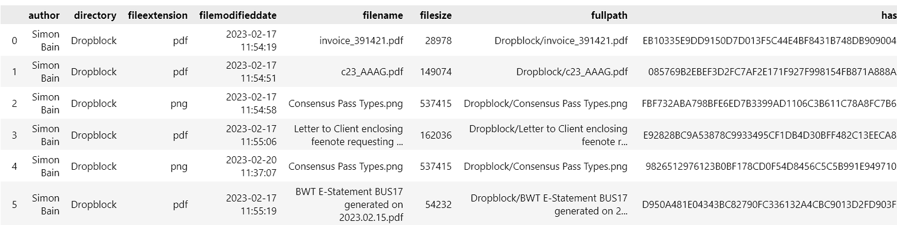
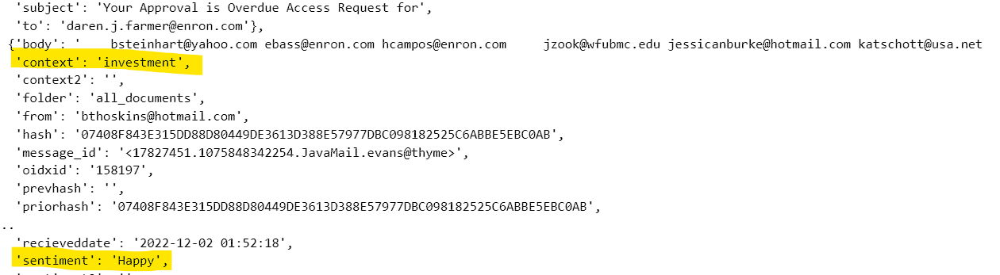

Sample code
===========

*all these examples use the demonstration API key, which is limited to 100 requests per day.*
If you want to use the API for a project, please contact us at `developer help <mailto:devs@omniindex.io>`_ to get a production API key.

the demonstration uses the Enron email dataset, which is available at `https://www.cs.cmu.edu/~enron/ <https://www.cs.cmu.edu/~enron/>`_ which has been preprocessed and indexed by OmniIndex. The dataset is licensed under the `Creative Commons Attribution-NonCommercial-ShareAlike 3.0 Unported License <https://creativecommons.org/licenses/by-nc-sa/3.0/>`_.

Set up the OmniIndex API client
-------------------------------

- before we dive into the code, firstly, set up your python virtual environment and install the `omniindex` package:

.. code-block:: bash

   python3 -m venv venv
   source venv/bin/activate
   pip install --upgrade omniindex

- to your environment variables, add the api_key you received from OmniIndex.

.. code-block:: bash

   export OMNIINDEX_API_KEY=your_api_key 

- now you can start coding!

.. code-block:: python

   import omniindex as oi
   import os
   import json

   api_key = os.environ['OMNIINDEX_API_KEY']
   client = oi.OmniIndexClient(server="https://node1.omniindex.xyz/node",unit_name="enronemail",api_key=api_key, block_type="Owner", user="enronemail")
   

We can test this by fetching the block schema:

get_block_schematic
-------------------

Now you can use the `get_block_schematic` method to fetch block schematics from the OmniIndex API:

.. code-block:: python

   block_schematic = client.get_block_schematic()
   data = json.loads(block_schematic)
   print(data)

You will now have a JSON output of the block schematic:

.. code-block:: bash

   {'0': {'column_name': 'bodyowners', 'data_type': 'text'}, '1': {'column_name': 'bodysearchableowners', 'data_type': 'text'}, '2': {'column_name': 'contentsearchableowners', 'data_type': 'text'}, '3': {'column_name': 'context', 'data_type': 'text'}, '4': {'column_name': 'context2', 'data_type': 'text'}, '5': {'column_name': 'folder', 'data_type': 'text'}, '6': {'column_name': 'fromowners', 'data_type': 'text'}, '7': {'column_name': 'fromsearchableowners', 'data_type': 'text'}, '8': {'column_name': 'hash', 'data_type': 'character varying'}, '9': {'column_name': 'message_id', 'data_type': 'text'}, '10': {'column_name': 'oidxid', 'data_type': 'integer'}, '11': {'column_name': 'prevhash', 'data_type': 'character varying'}, '12': {'column_name': 'priorhash', 'data_type': 'text'}, '13': {'column_name': 'recieveddate', 'data_type': 'timestamp without time zone'}, '14': {'column_name': 'sentiment', 'data_type': 'text'}, '15': {'column_name': 'sentiment2', 'data_type': 'text'}, '16': {'column_name': 'subject', 'data_type': 'text'}, '17': {'column_name': 'toowners', 'data_type': 'text'}, '18': {'column_name': 'tosearchableowners', 'data_type': 'text'}}

get_folders
-----------

The `get_folders` method returns a list of folders in the dataset. You can use the `showRedacted` parameter to return the redacted data or the full data.

First, let's get a list of folders with the data redacted: (The use case for this is check that folders are present in the dataset, without revealing the folder names)

.. code-block:: python

   folders = client.get_folders("false")
   data = json.loads(folders)
   print(data)

You will now have a JSON output of the folders:

.. code-block:: bash

   {'results': [{'directory': 'Data has been redacted.'}, {'directory': 'Data has been redacted.'}, {'directory': 'Data has been redacted.'}, {'directory': 'Data has been redacted.'}, {'directory': 'Data has been redacted.'}]}

Now let's get a list of folders with the full data:

.. code-block:: python

   folders = client.get_folders("true")
   data = json.loads(folders)
   print(data)

You will now have a JSON output of the folders:

.. code-block:: bash
   
   {'results': [{'directory': '/data/user/0/com.example.dropblock/cache'}, {'directory': 'Dropblock/2023-03-07'}, {'directory': 'Dropblock/2023-03-02'}, {'directory': 'Dropblock/2023-03-01'}, {'directory': 'Dropblock'}]}Tests

get_searchchain
---------------

The `get_searchchain` method returns a JSON block for a search phrase within for a given block. You can use the `showRedacted` parameter to return the redacted data or the full data. There is one other parameter you can pass with this method, `block_id`, which is the block id you want to search within. If you don't pass this parameter, the method will search within the latest block.
which is `fulltext` or `files` - this means that if you only want to search the encrypted file content, you can do that with the `files` parameter.

.. note::

   The get_searchchain method is a perfect demonstration of how the OmniIndex Fully Homomorphic Encryption works. The data content is never decrpted, and the search is performed on the encrypted data. The search results are returned in encrypted form, and the data is never decrypted. Also note the two machine learning (Narrow AI) fields that are derived from the encrypted data:
      - sentiment
      - context

Let's get stuck into a query on the blockchain:

.. code-block:: python

   searchresult = client.get_searchchain("true", "working with google workspace", "fulltext")
   data = json.loads(searchresult)
   print(data)

You will now have a JSON output of the search results, which in this case will be every document that has the search phrase 'working with google workspace' in the document content, or title, showing the context and sentiment of that document:

We could go on to pull a specific content block, or version of that content using the `get_files` method, and will explore that next.

.. code-block:: bash

   { "results" : [{"author" : "matthew@omniindex.io ,sibain@omniindex.io ,james@omniindex.io ","context" : "investment","datetime" : "2022-12-02 19:49:00","directory" : "/OmniIndex/demonstration","filecreateddate" : "2022-12-02 11:27:00","fileextension" : "application/vnd.google-apps.document","filemodifieddate" : "2022-12-02 19:49:00","filename" : "OmniIndex Distributed Data Platform with Google Workspace","file" : "JVBERi0xLjQKJdPr6eEKMSAwIG9iago8PC9UaXRsZSAoT21uaUluZGV4IERpc3RyaWJ1dGVkIERhdGEgUGxhdGZvcm0gd2l0aCBHb29nbGUgV29ya3NwYWNlKQovUHJvZHVjZXIgKFNraWEvUERGIG0xMTAgR29vZ2xlIERvY3MgUmVuZGVyZXIpPj4KZW5kb2JqCjMgMCBvYmoKPDwvY2EgMQovQk0gL05vcm1hbD4+CmVuZG9iago2IDAgb2JqCjw8L1R5cGUgL1hPYmplY3QKL1N1YnR5cGUgL0ltYWdlCi9XaWR0aCAyNTAwCi9IZWlnaHQgMTgwMwovQ29sb3JTcGFjZSAvRGV2aWNlUkdCCi9CaXRzUGVyQ29tcG9uZW50IDgKL0ZpbHRlciAvRmxhdGVEZWNvZGUKL0xlbmd0aCA0NDQ5MjY+PiBzdHJlYW0KeJzs3Xd8VHW+//H57d679+5dvevaQBGFLW5xXV0riHTQdfda1oKC0tKxixXFRk9mQu/SSZkSQugQWiDUhA5JICEJgZDe+2Tm8z2/OUHvXZIJTWBSXs/H+WMX4sznzJxzjOd9Pp+vpgEAAAAAAAAAAAAAAAAAAAAAAAAAAAAAAAAAAAAAAAAAAAAAAAAAAAAAAAAAAAAAAAAAAAAAAAAAAAAAAAAAAAAAAAAAAAAAAAAAAAAAAAAAAAAAAAAAAAAAAAAAAAAAAAAAAAAAAAAAAAAAAA4AwMDAwIG4gCjAwMDA4MTYxMzQgMDAwMDAgbiAKMDAwMDgxNjM4NiAwMDAwMCBuIAowMDAwODE2OTI5IDAwMDAwIG4gCnRyYWlsZXIKPDwvU2l6ZSAzNwovUm9vdCAyNCAwIFIKL0luZm8gMSAwIFI+PgpzdGFydHhyZWYKODE3NDQ3CiUlRU9G","filesize" : "749017","fullpath" : "/OmniIndex/demonstration/OmniIndex Distributed Data Platform with Google Workspace","hash" : "FB25A50F51EF1B009ED4D2BBB2466A4427A1C3A3F3F09358677BE797126D2CC3","oidxid" : "7","priorhash" : "AAEB383EC54C3AE02A982DEBC03934869BAC737863369BE836F4F7EAFE48D495","sentiment" : "Happy"}]}

(For convenience, we have excluded the majority of the Encryption hash)

get_files
---------

In order to list files in a folder construct on the block chanin, we use the following (note that in this example we are using the pandas dataframe library)

.. code-block:: python

   fileresult = client.getfiles("true", "dropblock")
   data = json.loads(fileresult)
   data_df = pd.DataFrame(data['results'])
   print(data_df)

This gives you a list of files in the folder, and the encrypted content of the file:

You can see from the structure of the returned dataset that there is a 'context' field included, which is automatically calculated by the OmniIndex engine against a narrow machine learning
model or ontology. This is a great way to quickly identify the context of a document, and can be used to filter search results.

.. code-block:: bash

   <class 'pandas.core.frame.DataFrame'>
   RangeIndex: 20 entries, 0 to 19
   Data columns (total 9 columns):
   #   Column            Non-Null Count  Dtype 
   ---  ------            --------------  ----- 
   0   author            20 non-null     object
   1   directory         20 non-null     object
   2   fileextension     20 non-null     object
   3   filemodifieddate  20 non-null     object
   4   filename          20 non-null     object
   5   filesize          20 non-null     object
   6   fullpath          20 non-null     object
   7   hash              20 non-null     object
   8   context           2 non-null      object
   dtypes: object(9)  

run_analytic_query
-------------------

This POST method will run a query on the Blockchain. To use it you are required to know the definition of the blocks that you are querying. If your where syntax includes data that has been encrypted for searching you need to use curly braces around your search string. EG: 

.. code-block:: sql
   
   SELECT X FROM Y where thissearchableowners LIKE '%{what am i searching for}%'. 
   
The API will then convert this into a searchable ciphered stream.
Running this query is akin to a SQL or OData query on any dataset, except this one is protected by OmniIndex’s patented FHE.
The only thing to watch out for is that unlike standard SQL, there is no need to include the name of the datastore because that is defined by the unitName that we are working with. Similarly, there are no joins in ‘runanalyticquery’, but you can ‘SELECT’, ‘ORDER’, ‘LIMIT’ and set parameters including ‘LIKE’ to return the data that you want to query.
Note that when returning ‘data objects’ as opposed to ‘file objects’, these will be base64 encoded and you will need to handle decoding in your own scripts. This is standard practice for all major data store providers. 
Notice that the select statement is ‘SELECT * FROM WHERE […]’ 

.. code-block:: python

   query = "SELECT * FROM WHERE contentsearchableowners LIKE '%{enron}%' LIMIT 10 "
   queryresult = client.run_analytic_query("true", query)
   data = json.loads(queryresult)
   data_df = pd.DataFrame(data['results'])
   print(data_df)

post_minedata
-------------

This POST method will add a new block on the Blockchain. To use it you are required to know the definition of the blocks that you are adding to. Blockchain by definition are immutable, so you cannot update a block, but you can add a new block with updated data. It is also necessary to pass the master encryption key when creating a new block
as always, we would recommend that you never type this in your code, but use environment variables or a config file to store this information. Having followed these strict rules, you need
only pass 2 parameters to the API which are the master encryption key and the data that you want to add to the blockchain. The data is passed as a JSON string, and the API will return only status code 200. It will do this even if you are unsuccesful in adding to the blockchain, 
we are very careful not to return any information that could be used to identify the data that is on your blockchain, even if the appaling event of your encryption key being known to a bad actor.

.. warning:: 
   If you are using the OmniIndex API to add data to the blockchain, you are responsible for ensuring that the data you are adding is compliant with the GDPR and other data protection laws. 
   You are also responsible for ensuring that you have the right to add the data to the blockchain.

.. note:: 
   as of version 0.1.11, the JSON parser will only accept strings, so you will need to convert any numbers to strings before adding to the blockchain.

.. code-block:: python

   # even though the data is JSON, it needs to be passed as a string, see the unix timestamp and filesize examples below
   data = '{"blahEncrypt": "blah1", "contentsearchable": "Some fabulous content", "dateAdded": "2021-01-01", "dateModified": "190266420000", "fileExtension": "txt", "fileSize": "100", "filename": "test.txt"}'
   result = client.post_minedata(MASTER_KEY, data)
   print(result)

Datasets, dataframes and pandas
-------------------------------

If you want to use the popular Pandas dataframe library, the OmniIndex API returns JSON string, which needs to be loaded as JSON using the JSON library.

.. code-block:: python

   import pandas as pd
   import json

   searchresult = client.get_searchchain("true", "working with google workspace", "fulltext")
   data = json.loads(searchresult)
   df = pd.DataFrame(data['results'])
   print(df)

Tests
=====

API endpoint tests
------------------

- to run the tests, first install the `pytest` package:

.. code-block:: bash

   pip install pytest

.. note:: 
   you will need to have set the following environment variables:
    - 'OI_API_TEST_NODE' the node you want to test
    - 'OI_API_TEST_USER_KEY' the user key you want to test
    - 'OI_API_TEST_DEMO_KEY' another user key you want to test
    - 'OI_API_TEST_USER_DEMO' the user name of the user key you want to test 
    - 'OI_API_TEST_UNIT_DEMO' the unit name of the user key you want to test
   

- then run the tests:

.. code-block:: python

   def test_ssl_api_endpoint():
    # import the requests library
    import requests
    
    endpoint = "https://api.omniindex.xyz/api_v1" # set the api endpoint
    response = requests.get(endpoint, verify=True) # make a request to the endpoint
    
    assert response.status_code == 200 # assert that the response is successful

Redaction test
--------------

When you run a call with showRedacted=True, the API will return the redacted data. To make sure that the redaction is working correctly, we have a test that checks the redaction has happened when set to 'false'

.. code-block:: python
   
   def test_get_folders_false_returns_json_string():
    """Test that the get_block_schematic() method returns a valid JSON string when showProtected is set to false"""
    client = OmniIndexClient(NODE, USER_DEMO_KEY, UNIT_DEMO, 'Owner', USER_DEMO)    # user your own api key etc here
    json_string = client.get_folders("false")
    assert type(json_string) == str
    assert json.loads(json_string) is not None
    assert json.loads(json_string) != {}
    json_data = json.loads(json_string)
    assert "Data has been redacted" in json.dumps(json_data) # check that the data has been redacted
